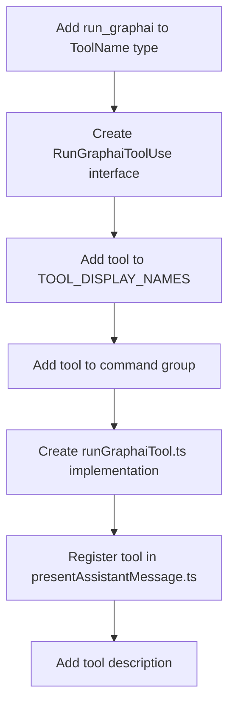

# Run GraphAI Tool Implementation Plan

## Overview

This document outlines the implementation plan for adding a `run_graphai` tool to Roo Code. The tool will execute GraphAI workflow files when they are in the context, similar to how the reference GraphAI debugger VS Code extension works.

## Background Analysis

### Current Roo Code Architecture

- Tools are defined in [`src/shared/tools.ts`](../src/shared/tools.ts)
- Tool implementations are in [`src/core/tools/`](../src/core/tools/)
- Tools are organized into groups: read, edit, browser, command, mcp, modes
- The [`execute_command`](../src/core/tools/executeCommandTool.ts) tool provides a good template for CLI-based tools

### GraphAI File Structure

GraphAI files use YAML or JSON format with this structure:
```yaml
agents:
  node_name:
    agent: agent_type
    name: "Display Name"
    description: "Node description"
    inputs:
      input_name: ":source_node"
```

### Reference Implementation

The GraphAI debugger extension executes GraphAI files using:
- CLI command: `graphai <filepath>`
- File validation for `.yaml`, `.yml`, `.json` extensions
- Error handling with LLM analysis
- Interactive webview for output display

## Implementation Plan

### Phase 1: Core Tool Registration



### Phase 2: File Changes Required

#### 1. `src/shared/tools.ts`
- Add `run_graphai: "run graphai workflows"` to `TOOL_DISPLAY_NAMES`
- Create `RunGraphaiToolUse` interface:
```typescript
export interface RunGraphaiToolUse extends ToolUse {
    name: "run_graphai"
    params: Partial<Pick<Record<ToolParamName, string>, "path">>
}
```
- Add to `command` tool group alongside `execute_command`

#### 2. `src/core/tools/runGraphaiTool.ts` (NEW FILE)
- Similar structure to `executeCommandTool.ts`
- Validate GraphAI file format (`.yaml`, `.yml`, `.json`)
- Execute `graphai <filepath>` command using existing terminal infrastructure
- Handle GraphAI-specific error patterns
- Provide enhanced error messages for common GraphAI issues

#### 3. `src/core/assistant-message/presentAssistantMessage.ts`
- Add case for `"run_graphai"` in tool execution switch
- Add tool name display logic

#### 4. `src/core/prompts/tools/run-graphai.ts` (NEW FILE)
- Create tool description following existing patterns
- Add to `src/core/prompts/tools/index.ts`

### Phase 3: Tool Implementation Details

#### File Validation Logic
```typescript
function isValidGraphAIFile(filePath: string): boolean {
    const ext = path.extname(filePath).toLowerCase()
    return ['.yaml', '.yml', '.json'].includes(ext)
}

function validateGraphAIContent(content: string, filePath: string): boolean {
    // Parse and validate GraphAI structure
    // Check for required sections (agents/nodes)
    // Return validation result
}
```

#### Command Execution
```typescript
// Similar to executeCommandTool but with GraphAI-specific handling
const command = `graphai "${filePath}"`
// Execute using existing terminal infrastructure
// Parse GraphAI-specific output and errors
```

#### Tool Description Format
```markdown
## run_graphai
Description: Execute a GraphAI workflow file. This tool runs GraphAI YAML or JSON files using the graphai CLI command. GraphAI files define agent workflows with nodes and connections for AI-powered data processing pipelines.

Parameters:
- path: (required) Path to the GraphAI YAML or JSON file to execute

Usage:
<run_graphai>
<path>path/to/workflow.yaml</path>
</run_graphai>

Example: Running a GraphAI workflow
<run_graphai>
<path>./workflows/data-processing.yaml</path>
</run_graphai>
```

### Phase 4: Enhanced Features

#### GraphAI-Specific Enhancements
1. **File Validation**
   - Check if file is a valid GraphAI YAML/JSON
   - Validate basic GraphAI structure (has `agents` or `nodes` section)
   - Provide helpful error messages for invalid files

2. **Context Awareness**
   - Auto-detect GraphAI files in workspace
   - Suggest running GraphAI when GraphAI files are in context
   - Integration with file reading tools

3. **Error Handling**
   - Parse GraphAI-specific error messages
   - Provide suggestions for common GraphAI issues
   - Integration with existing error handling patterns

## Implementation Strategy

### Step 1: Basic Tool Registration
1. Add tool definition to shared types
2. Create basic tool implementation
3. Register in tool execution pipeline

### Step 2: CLI Integration
1. Implement GraphAI CLI execution
2. Handle file validation
3. Process command output

### Step 3: Error Handling
1. Add GraphAI-specific error parsing
2. Implement helpful error messages
3. Integration with existing error patterns

### Step 4: Context Integration
1. Auto-detection of GraphAI files
2. Smart suggestions when GraphAI files are present
3. Integration with file reading tools

## Integration Points

### With Existing Tools
- `read_file` for reading GraphAI files
- `execute_command` for CLI execution patterns
- `list_files` for discovering GraphAI files

### With Tool Groups
- Add to `command` group alongside `execute_command`
- Consider creating a new `graphai` group if more GraphAI tools are planned

### With Error Handling
- Leverage existing error handling infrastructure
- Add GraphAI-specific error patterns and suggestions

## Future Enhancements

### Advanced GraphAI Integration
- Direct npm package usage for better control
- GraphAI workflow visualization
- Interactive debugging capabilities

### Workflow Management
- GraphAI workflow templates
- Workflow validation and linting
- Performance monitoring

### AI-Powered Features
- Automatic workflow generation
- Error analysis and suggestions
- Workflow optimization recommendations

## Testing Strategy

### Unit Tests
- Test file validation logic
- Test command execution
- Test error handling

### Integration Tests
- Test with sample GraphAI files
- Test error scenarios
- Test tool registration

### Manual Testing
- Test with reference GraphAI files
- Test error handling with invalid files
- Test integration with other tools

## Success Criteria

1. ✅ Tool successfully registered in Roo Code
2. ✅ Can execute valid GraphAI YAML/JSON files
3. ✅ Provides helpful error messages for invalid files
4. ✅ Integrates seamlessly with existing tool ecosystem
5. ✅ Follows Roo Code coding patterns and conventions
6. ✅ Includes comprehensive documentation and tests

## Implementation Notes

- Follow existing patterns from `executeCommandTool.ts`
- Ensure proper error handling and user feedback
- Maintain consistency with Roo Code's tool architecture
- Consider future extensibility for advanced GraphAI features
- Leverage existing terminal and command execution infrastructure

This implementation will provide a solid foundation for GraphAI workflow execution within Roo Code while maintaining consistency with existing patterns and allowing for future enhancements.