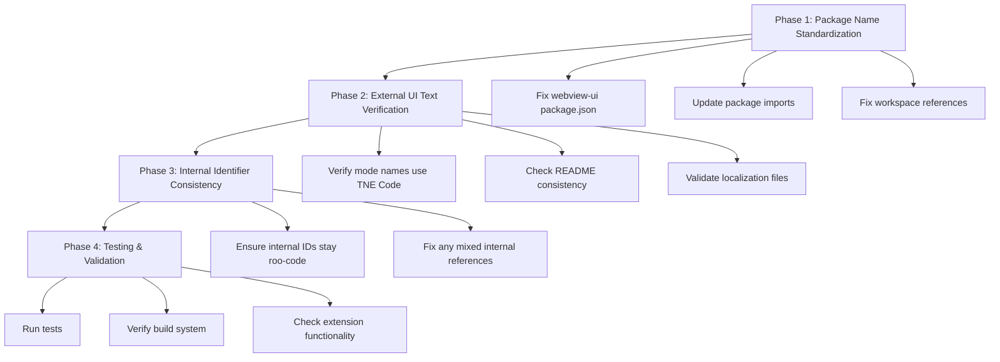

# TNE Code Branding Standardization Plan

**Date Created:** 2025-12-06 10:55:00  
**Mode:** Architect  
**Model:** claude-sonnet-4-20250514

## Overview

This plan standardizes TNE Code branding across the codebase to ensure:

- **Internal identifiers** use `@roo-code/` package names and "roo-code" references
- **External/UI visible** text consistently shows "TNE Code"
- Clean separation between internal technical naming and external brand presentation

## Current State Analysis

**✅ Already Correct:**

- README.md headers and user-facing content use "TNE Code"
- Most mode names and UI strings in localization files
- User-facing documentation

**❌ Needs Standardization:**

- Mixed package naming: some `@tne-code/` vs `@roo-code/`
- webview-ui package.json shows `@tne-code/vscode-webview`
- Inconsistent import statements across codebase

## Implementation Plan

### Phase 1: Package Name Standardization

**1.1 Fix webview-ui package.json:**

- Change `"@tne-code/vscode-webview"` → `"@roo-code/vscode-webview"`
- Change `"@tne-code/types": "workspace:^"` → `"@roo-code/types": "workspace:^"`
- Update any other `@tne-code/` references to `@roo-code/`

**1.2 Verify package imports across codebase:**

- Ensure all TypeScript imports use `@roo-code/types`, `@roo-code/cloud`, etc.
- Fix any remaining `@tne-code/` imports found in the codebase
- Update import statements in src/ and webview-ui/

**1.3 Update workspace references:**

- Check pnpm-workspace.yaml for consistency
- Verify turbo.json task dependencies
- Ensure build system references are correct

### Phase 2: External UI Text Verification

**2.1 Mode Names:**

- Ensure all mode display names use "TNE Code" (not "Roo Code")
- Verify [`src/shared/modes.ts`](src/shared/modes.ts) mode definitions
- Check webview UI component text

**2.2 Documentation:**

- Verify README.md maintains "TNE Code" branding
- Check CONTRIBUTING.md and other user-facing docs
- Validate localization files across all languages

**2.3 User Interface Text:**

- Terminal names, code action titles
- Webview titles and headers
- Error messages and notifications

### Phase 3: Internal Identifier Consistency

**3.1 Internal References:**

- File paths, directory names (keep as `roo-code`)
- Package scopes (`@roo-code/`)
- Internal configuration keys
- Git configuration and internal tooling

**3.2 Mixed References:**

- API endpoints and headers (keep as `roo-code`)
- Extension IDs and internal naming
- Log file names and paths

### Phase 4: Testing & Validation

**4.1 Build System:**

- Ensure monorepo builds successfully
- Verify turborepo task execution
- Check package resolution

**4.2 Extension Functionality:**

- Test VSCode extension loading
- Verify webview UI renders correctly
- Test mode switching and functionality

**4.3 Comprehensive Testing:**

- Run full test suite
- Verify localization loading
- Test package imports

## Risk Assessment

**Low Risk:**

- README and documentation updates
- UI text changes in localization files

**Medium Risk:**

- Package name changes (potential import conflicts)
- Workspace configuration updates

**High Risk:**

- None identified (changes are mostly textual)

## Expected Files to Modify

**Configuration Files:** (~5 files)

- webview-ui/package.json
- Any workspace configuration files with mixed references

**TypeScript Files:** (~10-20 files)

- Files with mixed `@tne-code/` vs `@roo-code/` imports
- Any remaining internal "TNE Code" references that should be "roo-code"

**UI/Localization Files:** (~5-10 files)

- Any remaining "Roo Code" in user-facing text
- Mode name consistency checks

## Success Criteria

**Internal Consistency:**

- All packages use `@roo-code/` scope
- Internal identifiers consistently use "roo-code"
- Clean import statements throughout codebase

**External Branding:**

- All user-facing text shows "TNE Code"
- Consistent branding across all languages
- Professional external presentation

**System Stability:**

- No breaking changes to functionality
- Maintained compatibility with existing workflows
- Clean monorepo structure

## Implementation Flow

## Next Steps

1. **Execute Phase 1** - Start with package.json fixes
2. **Progressive Testing** - Test after each phase
3. **Documentation Updates** - Update any affected docs
4. **Final Validation** - Comprehensive testing of all functionality
